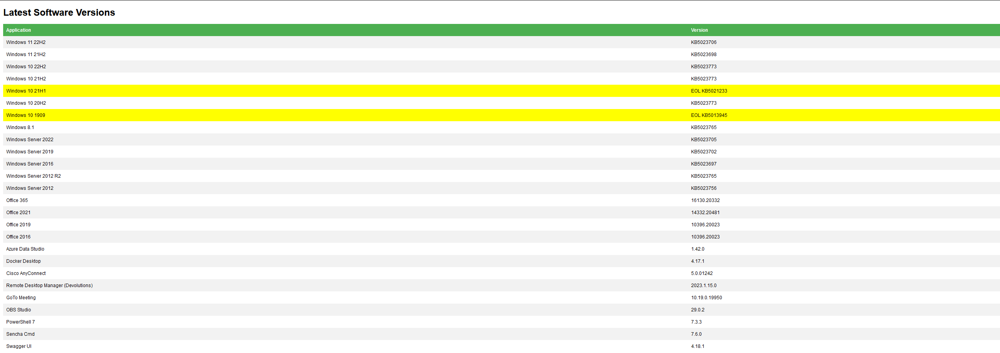
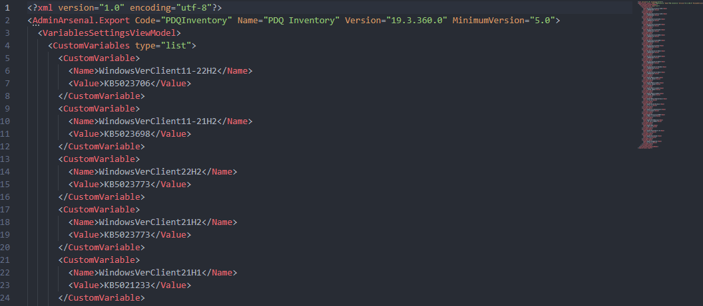
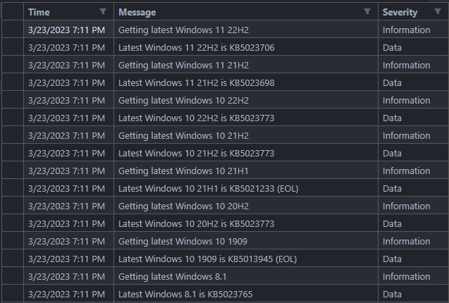

# 🌐 PowerShell WebScraper - Software Version Finder

> A PowerShell script that automatically collects the latest version of software from different websites and creates a formatted HTML file, XML file and log file for easy overview and import. This script currently collects the latest KB version of all still active Windows 10 and 11 versions, as well as servers. Beyond that, it also checks Microsoft Office, Azure Data Studio, and much more.

## Table of Contents
- [🌐 PowerShell WebScraper - Software Version Finder](#-powershell-webscraper---software-version-finder)
  - [Table of Contents](#table-of-contents)
  - [📝 Features](#-features)
  - [⚙️ Requirements](#️-requirements)
  - [🚀 Setup](#-setup)
  - [🔑 Configuration](#-configuration)
  - [📷 Screenshots](#-screenshots)
  - [📰 License](#-license)

## 📝 Features
The Script generates a HTML file, XML file and log file for easy overview and import. The XML file is formatted for easy import into PDQ. The Log file is a csv file that can be imported into Excel for easy overview. It can also send an email with the HTML file as an attachment, if you want to run it as a scheduled task.

The Script currently collects the following software versions:
- Windows 11 
- Windows 10
- Windows 8.1
- Windows Server 2022
- Windows Server 2019
- Windows Server 2016
- Windows Server 2012 R2
- Windows Server 2012
- MS Office 365
- MS Office 2019
- MS Office 2016
- Azure Data Studio
- Docker Desktop
- Cisco AnyConnect
- Devolutions Remote Desktop Manager
- GoToMeeting
- OBS Studio
- PowerShell 7
- Sencha Cmd
- Swagger UI

## ⚙️ Requirements
- PowerShell 5 to be used for execution
- PowerShell 7 to be installed for dependencies

## 🚀 Setup
1. Get the source code either via `git clone git clone https://github.com/Rabenherz112/PowerShell-VersionCollector.git` or by downloading the zip file and extracting it in your preferred location.
2. Open the `WebScraper.ps1` file in your favorite text editor and configure the first 40 lines to your needs.
3. Open a PowerShell window and navigate to the folder where you extracted the source code.
4. Run the script with `.\WebScraper.ps1`.

## 🔑 Configuration
The first 40 lines of the script are used for configuration. The following parameters can be configured:
- `DEBUG` - If set to `$true`, the script will output debug messages to the console. Default is `$false`.
- `SEND_MAIL` - If set to `$true`, an email will be sent with the HTML file as an attachment. Default is `$false`.
- `OUTPUT_HTML_NAME` - The name of the HTML file that will be generated. Default is `LatestSoftwareVersions-$DATE.html`.
- `OUTPUT_XML_NAME` - The name of the XML file that will be generated. Default is `LatestSoftwareVersions-$DATE.xml`.
- `OUTPUT_LOG_NAME` - The name of the log file that will be generated. Default is `LatestSoftwareVersions-$DATE.csv`.
- `OUTPUT_HTML_PATH` - The path where the HTML file will be generated. Default is `$PSScriptRoot\Output`.
- `OUTPUT_XML_PATH` - The path where the XML file will be generated. Default is `$PSScriptRoot\Output`.
- `OUTPUT_LOG_PATH` - The path where the log file will be generated. Default is `$PSScriptRoot\Logs`.
- `MAIL_MANUALLY_UPDATE` - Here you can enter additional software that is not automatically collected by the script. It will show up in the email.

## 📷 Screenshots
HTML Document Preview:

XML Document Preview:

CSV Log File Preview:

## 📰 License
This Project is licensed under the GNU General Public License v3.0. See the [LICENSE](LICENSE) file for details.